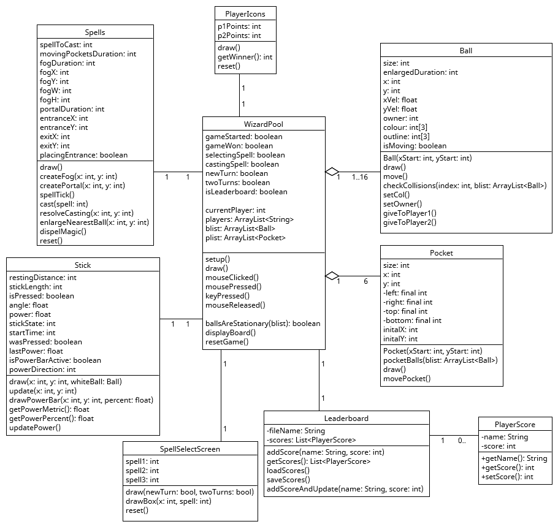
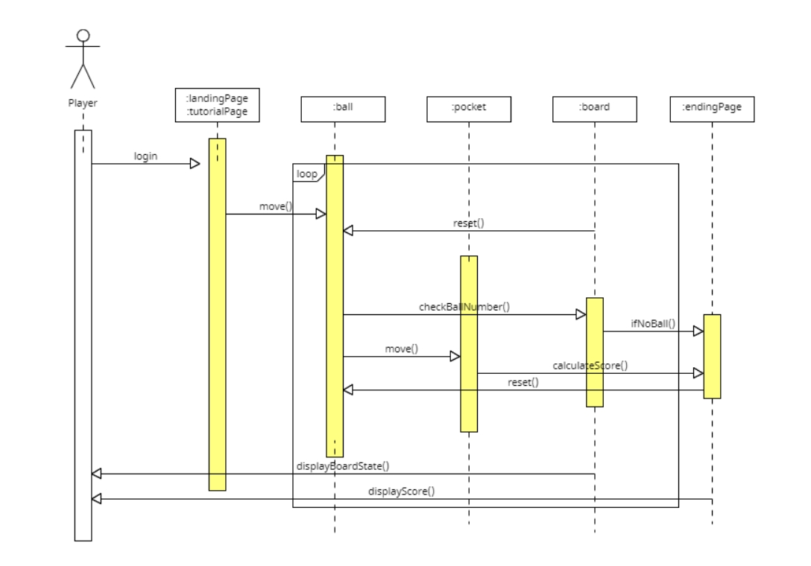

# Wizard Pool: A Software Engineering Group Report

## Table of Contents

1. [Team](#team)
2. [Introduction](#introduction)
3. [Requirements](#requirements)
4. [Design](#design)
5. [Implementation](#implementation)
6. [Evaluation](#evaluation)
7. [Process](#process)
8. [Conclusion](#conclusion)

## 1. Team 

<table>
  <thead>
    <tr>
      <th>Name</th>
      <th>ID</th>
      <th>Team photo</th>
    </tr>
  </thead>
  <tbody>
    <tr>
      <td>Jake Roberts</td>
      <td>ci19032@brsitol.ac.uk</td>
      <td valign="top" rowspan="5">
      
    </td>
    </tr>
    <tr>
      <td>Ka Hong Chiang</td>
      <td>pa22182@brsitol.ac.uk</td>
    </tr>
    <tr>
      <td>Saifuddin Mohammad</td>
      <td>op22194@brsitol.ac.uk</td>
    </tr>
    <tr>
      <td>Waei Jin Tan</td>
      <td>hh22165@brsitol.ac.uk</td>
    </tr>
    <tr>
      <td>Joshua Carey</td>
      <td>mp19039@brsitol.ac.uk</td>
    </tr>
  </tbody>
</table>

## Please find our video presentation here: [Wizard Pool Video](https://www.youtube.com/watch?v=MSVUIefDKOQ)

## 2. Introduction 

Wizard Pool is an innovative and engaging game that combines the novel gameplay of 8-ball Pool, with a twist of magic. In this game, players take on the role of wizards and utilize their magical abilities to cast a huge variety of unique and amazing spells, providing a magical and interactive twist on the classic pool game.

The basic concept of Wizard Pool revolves around players competing against each other in a game of pool, with the primary objective being to pocket all of their assigned balls and, eventually, the 8 ball. However, the game stands out from its traditional counterpart through the introduction of magical spells. These spells grant players a wide range of abilities that can significantly impact the game. These spells can be used to by a player to score a ball or also to prevet the opponent from scoring. For example, players can move the pockets, manipulate the trajectory of the balls, create portals to teleport balls, or even unleash more powerful spells to gain a competitive advantage.

## 3. Requirements 

### 3.1 Brainstorming

An initial brainstorming session was conducted to gather ideas to decide the core type of game we wanted to create. We discussed various game genres and brainstormed a list of potential game ideas. We were overwhelmed by the potential possibilites but given the time constraint we then narrowed down our list of ideas to a few concepts that we felt were the most interesting and feasible to develop.

A shortlist of the existing types of games we considered can be found here: [Brainstorming](/documents/Brainstorm.txt)

Paper prototypes were created for or two favourite game ideas, to help us visualize the game mechanics and determine which one would be the most fun to play.
A video presentation of the 'Wizard Pool' paper prototype can be found here: [Wizard Pool Paper Prototype](https://youtu.be/5fchX9gBfbg)

<table>
  <tr>
    <td>
      
    </td>
    <td>
      
    </td>
    <td>
      
    </td>
  </tr>
  <tr>
    <td>
      
    </td>
    <td>
      
    </td>
    <td>
      
    </td>
  </tr>
</table>

### 3.2 Game Features
After settling on 'Wizard Pool' as the game concept, the paper prototype was used to create a list of potential features of the game that we could implement, which was split into two catagories: standard pool features and wizard features. The standard pool features were the core gameplay mechanics of the game, while the wizard features were the unique abilities that the wizards could use to alter the game dynamics and gain a strategic advantage.

| Pool Features | Wizard Features |
| ------------- | --------------- |
| 15-balls and a cue ball | Movable pockets |
| Movable cue stick, aiming and shooting pool balls | Portals for the balls |
| Pocketing balls to gain points | Teleporting the cue ball |
| Pocketing the 8-ball to win the game | Increase the size of a ball |
| 8-ball rules | Fog over the pool table |
| 1v1 gameplay |
<!-- merge cells -->
| User Features| 
| ------------- |
| Selecting a wizard avatar and input name | 
| Onboarding tutorial | 

These were the core features of the game that were of the highest priority, and were the ones that we would focus on implementing first.

### 3.4 Defining Game Requirements

<!-- With a prioritized list of features in hand, we proceeded to define the game requirements in more detail. This process involved creating use case diagrams, user stories, and early-stage design mockups to provide a clear vision of how the game would function and how players would interact with it.  -->
The process of defining the game requirements more thoroughly involved creating use case diagrams, user stories, to help visualise the game's main functionalities.

#### 3.4.1 Use Case Diagrams

We created this use case diagram in order to capture the interactions between the current player and the system during a generic turn.

Although we'd later add landing and tutorial pages which introduced more user interactions, this inital diagram helped us to understand the basic requirements for the distinct interfaces we'd need to present the user with during the game: we'd need one to let them select and potentially place a spell, one to let them line up a shot and one that gives them an indication on how hard they're about to hit the white ball with the cue. We'd also need some way to let them view the leaderboard.

#### 3.4.2 User Stories
To develope the workflow of the game, user stories were created, which would capture the features and functionalities of the game from the players' perspective. 

- User Story 1: As a player, I want to hit the balls with the cue stick to pocket them into the pockets.
- User Story 2: As a player, I want a tutorial to teach me how to play the game.
- User Story 3: As a player, I want to play against another player in a 1v1 match, where the winner is the first player to pocket all of their assigned balls and the 8-ball.
- User Story 4: As a player, I want to cast spells to alter the game dynamics and gain a strategic advantage.

### 3.5 Requirements Validation
<!-- 
Finally, we validated our game requirements by seeking feedback from potential players and colegues. This feedback helped us identify any issues or inconsistencies in our requirements and provided valuable insights for improving the game's design and functionality.

By following this structured process for gathering and defining the requirements for Wizard Pool, we were able to create a solid foundation for the game's design -->
Validation of the game requirements was done by seeking feedback from potential players and colleagues. This feedback provided valuable insights for improving the game's design and functionality.

### 3.6 Decision-making Process

Throughout the requirements gathering process, the team consistently communicated and made decisions collaboratively. Regular team meetings were held to discuss the progress, address any concerns, and ensure that everyone was on the same page. This collaborative approach fostered a strong sense of teamwork and helped maintain a clear vision for the game moving forward.

### 3.7 Final List of Requirements

Based on research, brainstorming, prioritization, and validation, the following list of requirements for Wizard Pool were established:

1. Engaging gameplay that combines traditional pool mechanics with magical spells.
2. A diverse range of spells that offer strategic depth and variety to the gameplay.
3. Intuitive controls for aiming and shooting pool balls, as well as casting spells.
5. A ranking system and leaderboard to encourage competition among players.
6. Customizable wizard avatars for players to express their individuality.
7. A visually appealing and immersive game environment.
9. A tutorial or help system to assist new players in learning the game mechanics.
10. Accessibility options to ensure the game is enjoyable for a wide range of players.

With these requirements in place, the team was well-equipped to move on to the design and implementation phases of the Wizard Pool project, working together to bring this innovative game concept to life.

## 4. Design 
<!-- 
In this section, discuss the overall design of the game, including system architecture, class diagrams, and behavioral diagrams.
<!--  -->
### 4.1 System Architecture and Class Diagram

The system architecture of Wizard Pool is designed using object-oriented principles to ensure modularity, maintainability, and ease of collaboration among team members. The game's main classes and their relationships are displayed in the class diagram below. The diagram also shows the main methods and attributes of each class, as it was initially designed. The implementation of these is detailed in section 5 <a href="#implementation">Implementation</a>.

At the top of the hierarchy is the Game class, which is the entrance point for starting and ending the game. The game class will initialise the table and all the balls ready for the game to be played. The controller will then handle the interactions between the player and the game, using the cue to hit the balls.

Naturally, our classes ended up deviating from this early design. About halfway through development, when we needed to begin implementing the landing and tutorial pages, we created an updated class diagram to ensure everyone was clear on the relationship between the classes we had currently impelemented and those that were in development.

### 4.2 Sequence Diagrams
To better understand the interactions between the players and the game a sequence diagram was create to show the flow of the game over time. The diagram shows the interaction of a single player and the system, however in real life there are two players performing the same interactions.

The landing screen welcomes the player and requests them to input their name and choose an avatar from a range of options, adding a personalized touch to the gaming experience. Once these initial steps are complete, the player embarks on an interactive tutorial that acquaints them with the game controls, various spells, and strategies to maximize their performance in the actual game.

Upon successfully completing the tutorial, the player transitions to the main game window, where the core gameplay unfolds. The primary game loop consists of the following steps:

- The player selects a spell from a variety of magical abilities, each with distinct effects on the game dynamics and potential for strategic usage.
- The player positions the cue stick, adjusts its angle, and controls its power to strike a ball on the pool table, initiating the ball's movement.
- As the balls collide, pocket, or perform other interactions, the players' scores are updated accordingly, reflecting the current state of the game.
- The game continually evaluates the state of play, checking if a player has fulfilled the victory conditions.

If a player emerges victorious, the game comes to an end, and the leaderboard is displayed, showcasing the rankings and scores of all participants. At this point, players are presented with the option to either restart the game and compete anew or exit the application. If no player has achieved victory, the game seamlessly continues through the main loop, maintaining its immersive and engaging nature.

## 5. Implementation 

Before writing any code for the game, we split the project into smaller sections that would all need to be implemented for the game to be functional. The most challenging of these were the physics of the ball collisions, the spell system and the landing pages.

### 5.1 Ball Collisions

One of the three main challenges we encountered was enabling the balls to collide with one another. Making a ball bounce off the edge of the table is simple - just invert the x or y velocity. However, implementing collisions between two moving balls connecting at odd angles proved to be much more difficult.

In our initial attempts, we tried splitting each ball's directional vector into components parallel and perpendicular to the line of centers between the balls. We then aimed to resolve the collision between the perpendicular vectors and calculate the new x and y velocities for each ball based on that.

>*Some rough, early calculations*

This approach was challenging to compute and frequently led to balls sticking together. This issue occurs when two balls touch, prompting the system to alter their travel directions so they move away from each other. However, if they don't separate entirely within a single frame, the game will detect that they're still in contact and mistakenly reverse their directions again. This results in a situation where the balls are in perpetual collision, unable to break free from one another.

We ultimately decided to calculate the scalar product of the vector from the center of ball B to the center of ball A, and a vector combining the directional vectors of A and B:

<!--  -->

$$
\begin{aligned}
\overrightarrow{ab} \cdot \overrightarrow{(b_{\text{Vel}} - a_{\text{Vel}})} = (a_x - b_x)(b_{x\text{Vel}} - a_{x\text{Vel}}) + (a_y - b_y)(b_{y\text{Vel}} - a_{y\text{Vel}})
\end{aligned}
$$

This value essentially serves as an indicator of the similarity between these two vectors. Most importantly, if the value is negative, it means the balls are moving apart. By checking this value and allowing only balls that are moving towards each other to collide, we successfully resolved the issue of balls sticking together.

### 5.2 Cue Aiming and Firing
In order to let the players actually hit the white ball, we created a new ‘Stick’ (cue) class. Processing allows us to track the current position of the user’s mouse, so the cue can be ‘aimed’ by drawing it in relation this position. Holding down left click charges an internal ‘power’ tracker in the class. On release, the white ball is given velocity relative to mouse position with a magnitude determined by the ‘power’ of the cue.

Upon testing, we found lots of users thought that the ball would be fired in the direction of the cue, rather than away from it. To remedy this, we added guidelines opposite the cue to show what the direction of travel would be. We also added a dynamic bar to show the current power of the cue while the player was charging a shot.

### 5.3 Pockets and Player Logic
In our implementation, we created the Pocket class to manage pocket locations, pocketing the balls, moving pockets when a spell is active, and resetting pockets to their initial positions. The pocketBalls method iterates through all balls in the game and checks if the distance between the ball and the pocket is less than or equal to half the pocket's size. If true, the ball is pocketed, and the corresponding action is taken based on the type of ball pocketed, such as repositioning the white ball, determining the winner if the black ball is pocketed, or updating the player's points. The movePocket method moves the pockets around the table when the moving pockets spell is active, and the reset method returns the pockets to their initial positions when the game is restarted. 

The player logic is contained between two classes, which was contrary to the original game design, this way we can handle the display and the score logic separately. The turns logic is handled within the main server class 'WizardPool'.

### 5.4 Spells
Our second main challenge was implementing the spell system. Spells are handled by two classes: a ‘SpellSelectScreen’ object is used to display 3 random spells to the player for them to choose from, and a ‘Spells’ object can be passed the selected spell and handles the internal casting logic. By the end of the development process, we had 6 spells.
#### CREATE FOG
Creates a purple ellipse wherever the user clicks, obscuring all balls underneath. The size is somewhat randomised by this formula:

<!--  -->

$$
\text{len} = 500px + 200px \times \text{Math.random}()
$$

The position, shape and duration of the cloud is saved in the ‘Spells’ object, and the draw() function local to this object handles displaying it on the table.

  

#### ENLARGE BALL
Increases the radius of a ball. Initially, the player had to click directly on a ball to enlarge it. After receiving user feedback we changed the implementation so the ball closest to where the user clicks is enlarged, making it a bit easier and more intuitive to cast. 

Rather than saving which balls are or aren’t enlarged in the ‘Spells’ object, we instead gave each ‘Ball’ object an internal variable that says whether it’s enlarged or not, and how long for.

  

#### MOVING POCKETS
While active, this spell causes the pockets to revolve clockwise around the board. The duration is saved in the ‘Spells’ object, and every ‘Pocket’ object checks this during its draw() method and will move by 2 pixels if needed.

  

#### CREATE PORTALS
This allows the player to place and entrance portal and an exit portal on the table. Any balls that touch the entrance will be moved to the exit. The player clicks to place the exit first, then the entrance. In early testing this was the other way around, but if a ball touches the entrance before the exit is placed then it is teleported off-screen, making the game unplayable.

Portals can’t be placed too close to the edges of the table. This feature was implemented later based on user feedback, as it stops players teleporting balls directly into pockets and stops balls teleporting into the walls of the play area where they get stuck.

  

#### DISPEL MAGIC
This spell was added for game balance after an early testing phase, and sets the duration of all spells to 0 (thereby stopping all active spell effects). This can save a player from certain situations, for example if moving pockets is active and the black ball is at the edge of the table. During the players turn the pockets would move and scoop the black ball up, causing the current player to lose.  

#### EXPLOSIVE BALL
This spell was added late in the development process as users said they would enjoy having more spells to choose from. ‘SpellSelectScreen’ and ‘Spells’ are easily extendable to include a new spell, so implementation was not too hard. Like ‘Enlarge Ball’, the user selects a ball and this ball is internally marked as explosive. During any collision with this ball, the magnitude of the collision is artificially increased and the ball stops being explosive, causing a huge rebound.

  
>*In this example I pot the black...*

### 5.5 Landing Page and Tutorial page
The third main challenge we faced was implementing landing and tutorial pages at the start of the game. This wasn’t a simple case of adding a static screen before the actual game started - we needed to let both users input their names and select a character, then give them a fairly detailed tutorial to click through, all before the actual game was loaded and made playable.

The first page of the landing screen greets the users and allows them to enter their usernames. These are fed out of the ‘LandingPage’ class and to the main game server, so they can be displayed in-game and used on the leader board. The text inputs only allow letters and numbers, and if no name is used or if the same name is chosen an error message prompts the user to choose a different name.

The second screen prompts users to choose a wizard to play as, each with their own description and lore. Once the users have selected their wizards, they are taken to a final confirmation screen.

  

For the tutorial page, we wanted to provide players with all the necessary game information as clearly but briefly as possible. To accomplish this, we decided to go with a single tutorial page that would clarify the basic rules, spell descriptions and win conditions.

  

### 5.6 Ending and reset
If all the balls are cleared and the black ball is pocketed, the winner is determined. Their username is displayed and particle effects emulating fireworks display. On this win screen, or at any time during the game, players can choose to restart the game. In this case, all values in every class involved in the game process are reset to their starting states.

## 6. Evaluation 
<!-- bold text -->
The **Think Aloud Method** and the **Heuristic Evaluation Method** were used to evaluate the Wizard Pool game. These evaluations were conducted at two seperate times, once after the first iteration of the game was completed, and once after the second iteration was completed. These results then helped drive the next stages of development. 

**Stage 1:**
 
 
>*Evaluation 1: 17/03/23*
>
>Postitives:
> Realistic ball movements and collisions. There is a basic pool layout that is displayed on the screen, where the player can shoot the balls into the pockets
> 
> Negatives:
> The user interface(UI) and gameplay was not clear. The player was not sure how to cast spells, or how to shoot the balls. Switching between players was confusing.
 

  
 
>*Evaluation 2: 17/03/23*
>   
>Postitives:
> The player was able to shoot the balls into the pockets and have the score reflect this. The design of the game was appealing.
> 
> Negatives:
> The game is still a single page application with no tutorial or onboarding.
 

 

Two seperate heuristic evaluations were conducted at this stage of the project, which can be accessed through the following link: <a href="/documents/heuristic1.md">Heuristic Evaluation 1</a> and <a href="/documents/heuristic2.md">Heuristic Evaluation 2</a>.

This evaluation reinforced the feedback obtained from the think aloud method and helped identify the primary issues with the game at this stage. The main areas of concern were the onboarding and tutorial system, the player logic, and the user interface. Both the heuristic evaluation and think aloud evaluation processes offered valuable insights and clear objectives for the second stage of the development process.

The initial evaluations revealed some significant flaws in the game's flow. However, the mechanics and movement of the balls were found to be highly realistic, and the overall design was visually appealing. As these aspects were considered the most challenging to develop, they served as a solid foundation for the game's further development. By focussing on the areas of concern identified in the evaluations, more specific tasks could be created and assigned.

**Stage 2:**
 
 
>*Evaluation 3: 24/03/23*
>
>Postitives:
>- Improved UI with an intuitive player selection screen and tutorial explaining game mechanics.
>- Enhanced player logic, including accurate score tracking and game win/loss conditions.
>
> Negatives:
>- Lack of a leaderboard.
>- Absence of a functional spell system.
 
 

  
 
>*Evaluation 4: 24/03/23*
>   
>Postitives:
> - The game is now playable, with a clear tutorial and onboarding system.
> - The player logic is improved, with the score tracking correctly and players able to win and loose the game.
> 
> Negatives:
> - Some bugs still present in the pool logic, i.e. player turns not adding up correctly.
 

 
The second stage consisted of another think aloud evaluation, which helped identify that the previous development phase had been successful in fixing some of the initial issues. The UI of the game was now much more intuitive, with an initial player selection screen, and a tutorial that explained the game mechanics. The player logic was also improved, with the score tracking correctly and players able to win and loose the game. 

So more points were still raised in the evaluation, such as the lack of a leaderboard, and the lack of a working spell system. These issues became the focus of the next stage of development.

**Stage 3:**

The final stage of evaluation involved a System Usability Survey (SUS) and a NASA TLX questionnaire. The SUS was completed first as it was easier to setup and quicker to complete, it was completed by 6 participants, and the results were as follows:

| Participant | Q1 | Q2 | Q3 | Q4 | Q5 | Q6 | Q7 | Q8 | Q9 | Q10 | SUS Score |
|-------------|----|----|----|----|----|----|----|----|----|-----|-----------|
| 1           |  4 |  2 |  3 |  1 |  4 |  1 |  4 |  2 |  4 |  2  |   68.75   |
| 2           |  2 |  3 |  5 |  1 |  3 |  2 |  5 |  3 |  3 |  2  |   65      |
| 3           |  4 |  3 |  4 |  2 |  4 |  3 |  4 |  1 |  4 |  3  |   72.5    |
| 4           |  3 |  1 |  5 |  2 |  4 |  1 |  4 |  3 |  4 |  1  |   75      |
| 5           |  5 |  2 |  4 |  1 |  3 |  2 |  5 |  2 |  3 |  2  |   70      |
| 6           |  3 |  3 |  5 |  1 |  4 |  1 |  4 |  3 |  4 |  1  |   69.5    |
| Average     |  3.5| 2.3| 4.3| 1.3| 3.7| 1.7| 4.3| 2.5| 3.7| 1.8|   70      |

The average scores for questions Q1, Q3, and Q7 suggest that participants generally found the game enjoyable, easy to use, and believed that most people would learn to use it quickly. This is a positive sign, indicating that the game's interface and mechanics are generally well-designed and intuitive.

The average scores for questions Q2, Q4, Q6, and Q10 indicate that participants experienced some challenges with the game's complexity, need for technical support, inconsistency, and the learning curve. Although the scores in these areas were not extremely low, they suggest that there is room for improvement in making the game more consistent, less complex, and easier to learn without requiring technical assistance.

Finally the average scores for questions Q5, Q8, and Q9 demonstrate that participants found the functions in the game well-integrated, did not consider the game cumbersome, and felt confident using the system. These scores reflect positively on the overall game design and user experience.

The evaluation process provided valuable insights into the game's strengths and weaknesses, helping to guide its development. The Wizard Pool game has shown significant improvement since the initial evaluations. However, there is still room for further enhancement, particularly to the smoothness of the game's flow and the consistency of its mechanics.

<!-- 
### 6.3 Code Testing

Explain the approach taken to test the code, such as unit testing, integration testing, or system testing. Discuss the test coverage, any bugs discovered, and how they were resolved.

The cyclic complexity of our code was calculated as....  -->

## 7. Process 

In this section, discuss the team's collaboration process, including the tools used, team roles, and reflections on how the team worked together.

### 7.1 Teamwork

<!-- Describe the dynamics of the team, including how tasks were assigned, communication methods, and any challenges faced in working together. -->

The dynamics of our team involved weekly meetings in the lab and online collaboration. We used a Kanban board to keep track of tasks and assigned tasks to each team member on a weekly basis. The Kanban board was initially hosted on an online platform but was later moved to GitHub for simplicity. We decided that all individual development would take place on personal branches, and code would be merged into the main branch after being reviewed by another team member. This approach aimed to ensure high-quality code and maintain the main branch in a working state.

However, we faced some challenges with this method, as branches were often not merged in a timely manner, causing delays in development. We addressed this issue in our weekly meetings, and the team agreed to be more proactive in merging branches.
### 7.2 Tools

<!-- List the tools used by the team for collaboration, project management, and version control (e.g., Git, GitHub, Trello, or Slack). -->
For collaboration we used Microsoft Teams and WhatsApp. For a project management record we used a kanban board, hosted online. For version control we used GitHub.
The tools used are listed below:
- Microsoft Teams
- WhatsApp
- GitHub

### 7.3 Team Roles

Initially, we assigned specific roles to team members, but these roles did not last. Instead, we opted for a more flexible approach, allocating weekly tasks to each member based on their expertise and the project's needs. This ensured that everyone had a chance to take on various aspects of the project and stay fully involved in the development process.

During our meetings, we also implemented pair programming, or more accurately, group programming. This approach allowed us to brainstorm ideas while someone was able to input these ideas into the code, enabling us to test the ideas in real time. It was in these sessions that we were most productive, solving coding challenges and coming up with new ideas. This agile development approach allowed us to adapt our priorities based on the product's progress.

### 7.4 Agile Development
As we developed our game, we decided to adopt an agile approach to allow for flexibility and adaptability. This approach enabled us to make changes to various aspects of the design throughout the development period, constantly evaluating the work created. By using agile development, we were able to continuously test our game, find the bugs and make changes accordingly, which would have been more difficult using a waterfall development method.

Our agile approach also involved reassigning team roles and adjusting our priorities as needed. For example, we initially assigned team roles based on the specific classes that needed to be created. However, as the project progressed, we found that it was sometimes better to combine effort on certain areas.

### 7.4 Reflection
Throughout the development of our game, our team's collaboration process underwent several adjustments to better suit our needs. Overall, we functioned well as a team, with a strong emphasis on communication. We were able to adapt our approach and structure our time together as required, which ultimately contributed to efficiently completing the tasks assigned.

However, there were areas where improvements could be made. In retrospect, we could have been more proactive in addressing the issues with merging branches in a timely manner, as this caused delays in development. To avoid such delays in the future, we could set deadlines for merging branches and ensure that team members prioritize reviewing code changes, over other tasks.

## 8. Conclusion 

Throughout the development cycle, our team embraced an iterative approach, allowing us to continuously refine and enhance the game until we arrived at the final product. This involved multiple stages of brainstorming, development, feedback, and redesigning to ensure our game was both fun to play and met our design objectives.

### 8.1 Lessons Learned:  
During the development of our game, our team initially experienced issues with communication and managing individual development timelines, which led us to adopt agile methodologies. We began with Scrum and Kanban frameworks, utilizing timeboxing and sprint planning to allocate set durations for the completion of specific game features. We utilized visual Kanban board management tools to keep track of tasks categorized as "To Do," "In Progress," and "Completed." Our iterative development approach involved weekly/bi-weekly stand-up meetings, where team members showcased working game features developed during the sprint. This enabled group deliberation and consensus-building on whether features could be moved from "In Progress" to "Completed" categories. We fostered a collaborative and supportive team dynamic, maintained open communication, and consistently sought feedback from one another to ensure that code quality and requirements were effectively addressed. Each iteration consisted of a small piece of functionality developed within personal GitHub branches, which were then integrated into the larger project. Adopting an agile methodology was appropriate as it ensured high levels of collaboration and open communication for feedback among team members, which suited the working style of our group members.

### 8.2 Challenges:  
Prior to the implementation of Agile methodology, our team experienced issues in terms of managing timelines for developments. Fully functional code was subsequently merged into the main branch after weekly meetings and reviewed with team members. Issues with not having up-to-date code pushed to the main branch caused delays in development, with new functionalities being built on top of each other. Another challenge was having a large bucket list of complex features that required longer development times. To mitigate this, we reprioritized features to develop during sprints, focusing on key features that satisfied usability and functionality, before building new wizard spell features on top of the foundation that was built. Apart from the development process, three major challenges we tackled along the way were:

1: Game mechanics, the working of standard game as whole was pretty challenging, we have work on physics of collison for balls and implemented many math methods to make balls playable, also the stick which is used to hit the balls, designing it such that it has a dynamic power threshold was a cherry on top.

2: Spells: creating spells was a big task in itself, we spent weeks deciding what spells we will be implementing in our game, we decided to go with 5 unique spells given the complixity and playable aspect of game. making each spell which intracts with balls, table, pockets was pretty big task but we narrowed it down to 1 spell per week and with regressive testing we made it work perfectly.

3: Interface: Interface is not something we can neglect when it comes to game, what good is a game if it doesn't look good. We spent quite a bit of time discussing the visual aspects of the game, from the landing page, tutorial page to actual gameplay we rendered every page to look smooth and fascinating. We added various functionalities and resposivness aspects for each page to make it as much interactive as possible.

### 8.3 Future Work:  
Improvements to the current Wizard Pool game can be broken down based on two considerations. Firstly, we can add more game features and improve game flow, including the addition of more wizard "spell" features. However, this would require a substantial effort to deliver. Secondly, we can improve usability, as user feedback suggested that there were issues with the flow of the game, despite the mechanics being highly realistic. We made improvements to the UI of the game, which was now much more intuitive and had greater visual aids for users to navigate the game. Future enhancements to improve the flow of the game may include adding a navigation bar for players to exit or reset the state of the game.

## Individual contribution

| Team Member   | Contribution |
|---------------|--------------|
| Jake Roberts  |       1      |
| Saif Mohammad |       1      |
| Waei Jin Tan  |       1      |
| Joshua Carey  |       1      |
| Ka Hong Chiang|       1      |
